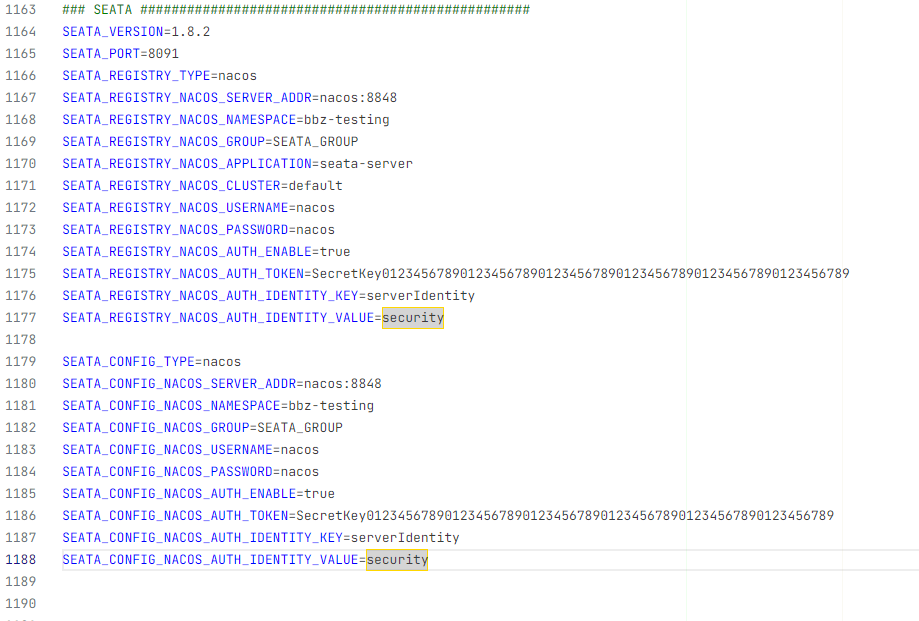
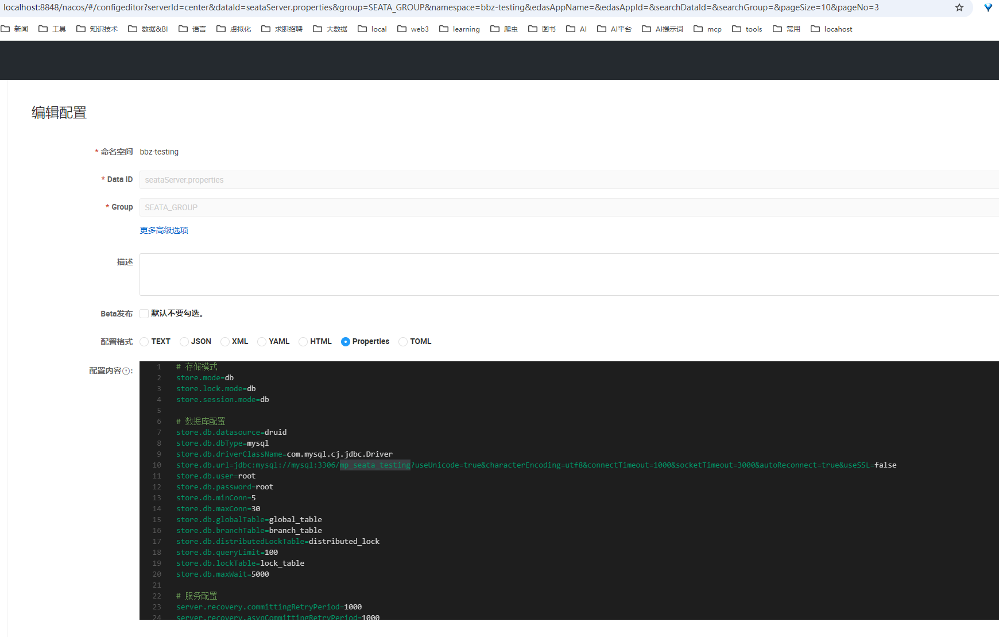

## seata server部署需求

### seata server 1.x版本使用db+nacos方式部署
    参见 https://seata.apache.org/zh-cn/docs/ops/deploy-by-docker-compose 章节 nacos注册中心，db存储

### 镜像使用版本 1.x 【已下载】

【已完成】docker pull seataio/seata-server,版本号: [1.4.2, 1.5.2, 1.8.0.2, 2.0.0-slim, latest]

### .env已经配置 【已配置】


### docker compose 中服务seata 【已配置】

【已配置】volumes映射, seata-server\resources\application.yml .

### seata依赖的服务 【已配置】

- nacos
  - 【已配置】nacos注册中心,通过配置环境变量(.env)参数,再配置docker compose容器seata的环境变量.
  - 【已配置】seataServer.properties已经在nacos中配置.
- mysql
  - 【已配置】在nacos中的,seataServer.properties获取连接字符串.数据库mp_seata_testing[已创建]。


### 已知问题

#### 1. seata镜像版本对mysql驱动支持是不同的?

可能会存在对应的驱动不在镜像中的情况,如果是需要放入到镜像对应目录让其加载.
低版本支持mysql5.7,驱动(com.mysql.jdbc.Driver),默认认证方式为mysql_native_password.
高版本支持mysql8.0,驱动(com.mysql.cj.jdbc.Driver),默认认证方式为caching_sha2_password.
mysql驱动目录位置: ..\mysql\libs\ .


#### 2. seata不同版本的镜像配置,存在配置方式差异,如何里处理?


处理方案：
  1. 获取镜像容器或者运行时的 /seata-server/resources 目录和文件,可以知道不同不版本的配置文件差异,例如： 有的支持 .conf,有的不支持.
    先启动/运行对应的容器或者镜像,得到id,通过 docker cp 命令获取镜像容器或者运行时的 /seata-server/resources 目录和文件,放入到seata-server/runtime对应版本的目录中.
  2. 针对差异进行版本处理适配,放入到seata-server/ver对应的版本的resources目录中,ver放入说明文件.
  3. 人工根据ver说明文件调整docker compose中seata服务的volumes映射,指向seata-server/ver对应的版本的resources目录.


seata 镜像 1.4.2 resources目录结构,seata-server/runtime/1.4.2/
```text
io/
logback/
META-INF/
file.conf
file.conf.example
logback.xml
README-zh.md
README.md
registry.conf
```

seata 镜像 1.5.2 resources目录结构,seata-server/runtime/1.5.2/
```text
io/
logback/
lua/
META-INF/
application.example.yml
application.yml
banner.txt
logback-spring.xml
README-zh.md
README.md
```
seata 镜像 1.8.0.2 resources目录结构,seata-server/runtime/1.8.0.2/

```text
docker/
io/
logback/
lua/
META-INF/
application.example.yml
application.yml
banner.txt
logback-spring.xml
README-zh.md
README.md
```


## Seata 部署资料说明

### seata的镜像主版本号1.x和2.x

#### seata docker image 1.x

容器镜像: [seataio/seata-server](https://hub.docker.com/r/seataio/seata-server)


#### seata docker image 2.x

容器镜像: [apache/seata-server](https://hub.docker.com/r/apache/seata-server)

### 参考信息

- [seata 官网文档地址](https://seata.apache.org/zh-cn/docs/user/quickstart/)
- [github 项目地址](https://github.com/apache/incubator-seata/tree/develop/script/config-center)
- [中文站点 docker compose部署](https://seata.apache.org/zh-cn/docs/ops/deploy-by-docker-compose)
- [版本升级指南](https://seata.apache.org/zh-cn/docs/ops/upgrade)

